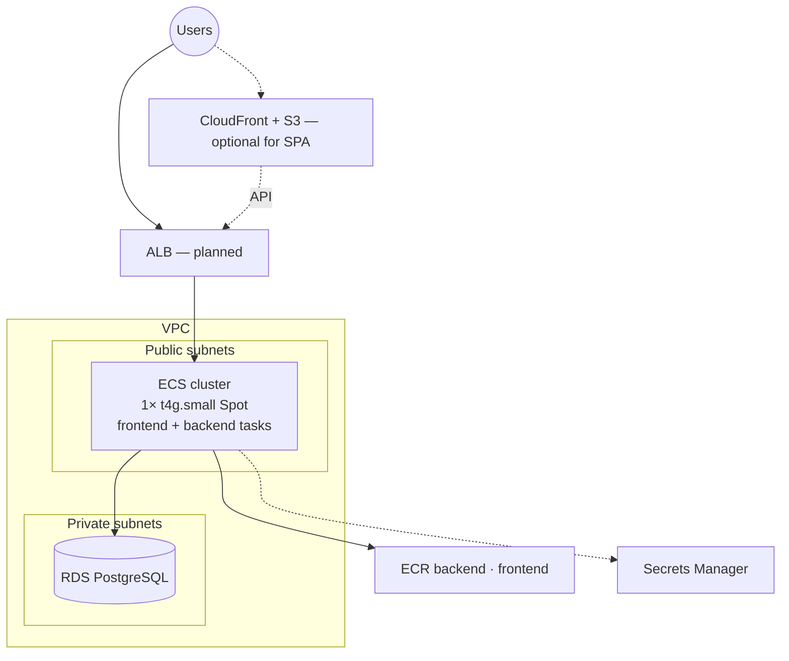

# Architecture choice: ECS instead of EKS

Decision record for how we run **teacher-wang-app** (Flask backend + React frontend) on AWS.

Related: [`architecture.md`](architecture.md) (what is provisioned), [`../README.md`](../README.md) (roadmap and toggles).

## Decision

**Use Amazon ECS on EC2 (Spot, Graviton) as the container platform. Do not use Amazon EKS for this stage of the project.**

| Choice | Detail |
| --- | --- |
| Orchestrator | **Amazon ECS** (control plane **free**) |
| Compute | **EC2** launch type, capacity provider on an ASG |
| Instance | `t4g.small` Spot (ARM), one instance for both apps |
| Placement | Public subnets + public IP (no NAT required) |
| Toggle | `enable_ecs` in `environments/prod/main.tf` (default `false`) |
| Images | Same ECR repos (`backend`, `frontend`); build `linux/arm64` for Graviton |

Task definitions, services, and ALB ingress are **follow-ups**; this decision locks the platform so we do not pay for Kubernetes until we need it.

## Context

The app is early-stage / solo-operated. Infra already includes VPC, RDS PostgreSQL, and ECR. We need somewhere to run two containers, not a multi-team Kubernetes platform.

EKS was sketched first (`enable_eks`), then rejected on cost: the managed control plane alone is about **$0.10/hr (~$73/mo)** whether or not any pods run, on top of nodes and (with private nodes) NAT.

## Options considered

Rough **eu-west-1, always-on** compute+delivery cost for this workload (excluding RDS ~$12–15/mo). Ballpark only.

| Option | Control plane | ~USD/mo excl. RDS | Notes |
| --- | --- | --- | --- |
| **EKS + Spot node + NAT** | ~$73 | ~110–120 | K8s ecosystem; expensive floor for 2 containers |
| **ECS on EC2 Spot (chosen)** | $0 | ~8–20 | Same ECR images; bin-pack both apps on one instance |
| ECS on Fargate | $0 | ~20–40 | Less ops on instances; higher compute unit price |
| App Runner + S3/CloudFront | n/a | ~15–40 | Very simple API hosting; less VPC control |
| Single EC2 / Docker Compose | $0 | ~10–15 | Cheapest DIY; weaker deploy story than ECS |
| Lightsail | bundled | ~5–15 | Fine for a prototype; weaker fit with existing VPC/RDS/ECR |

## Why ECS on EC2

1. **Cost** — No orchestration tax. Bill is dominated by one small Spot instance (and RDS we already need). Turning `enable_ecs` off destroys capacity and stops that bill.
2. **Fit** — Two long-running containers from ECR match ECS services/tasks naturally.
3. **Reuse** — Keeps the VPC, security groups (`app` → `db`), and ECR wiring already in this repo.
4. **No NAT for now** — Container instances use public subnets with a public IP so they can pull from ECR without a ~$32/mo NAT Gateway. Private+NAT remains available later if we harden placement.
5. **Escape hatch** — If we outgrow ECS (complex scheduling, large K8s-only tooling), we can revisit EKS knowing the trade-off.

## Why not EKS (for now)

- Fixed **~$73/mo** control plane before any application value.
- Private node groups typically need **NAT**, adding another always-on cost.
- Operational surface (kubectl, addons, upgrades) is larger than we need for two services.
- Extended support pricing if a cluster version ages is another foot-gun we do not want.

EKS remains a valid **later** choice for multi-service platforms or strong Kubernetes requirements—not for the current cost posture (`agent.md`).

## Target shape (ECS)



## How to enable / disable

In `environments/prod/main.tf`:

```hcl
enable_ecs = true   # create cluster + Spot capacity
# enable_ecs = false  # destroy capacity; ECS control plane fee is still $0
```

NAT stays off unless you deliberately move instances to private subnets later.

Images for these nodes should be **`linux/arm64`** (Graviton). On an Apple Silicon Mac that matches native builds; on other hosts use `docker buildx --platform linux/arm64`.

## When to revisit

Reconsider EKS (or ECS Fargate-only) if:

- You need Kubernetes-specific tooling or multi-cluster/multi-cloud portability
- Many independently scaling services make EC2 bin-packing awkward
- A team is already standardized on Kubernetes and ops cost is funded

Until then, **ECS on EC2 Spot** is the default path in this repository.
