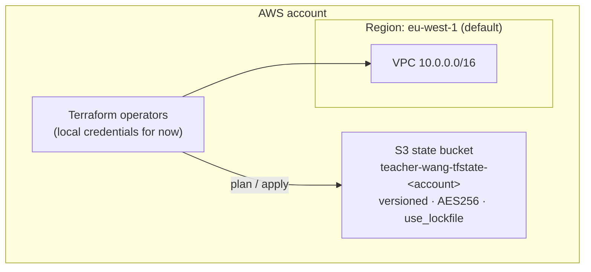
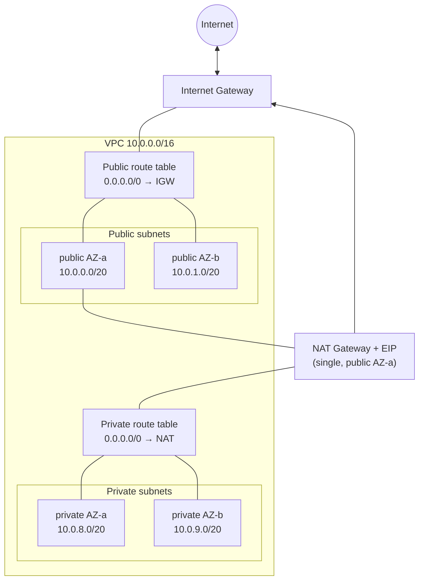
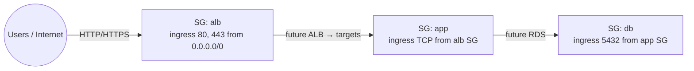
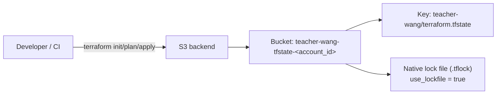
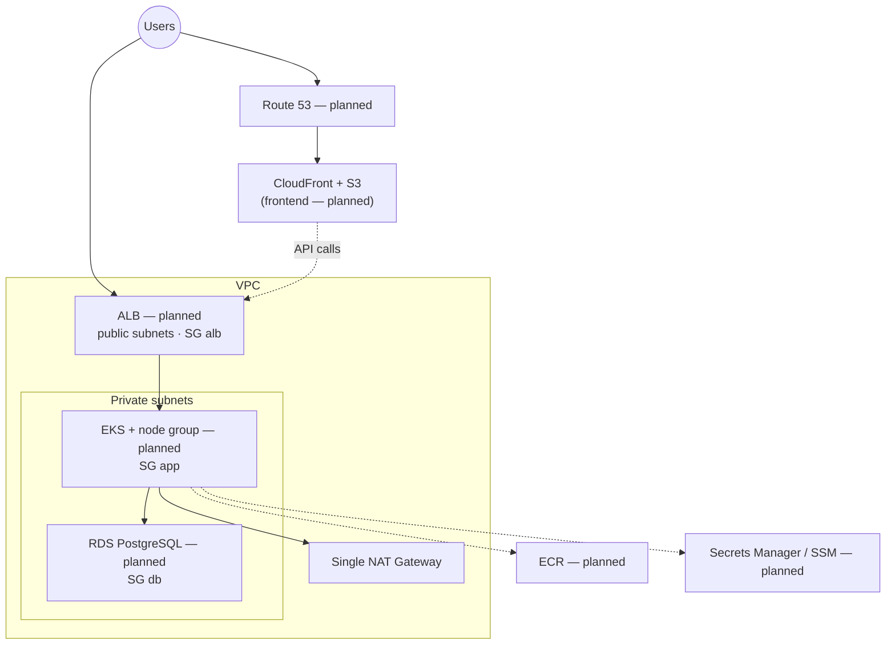

# Architecture

Living overview of the AWS layout provisioned by this repository.
Update this file whenever components are added, removed, or rewired.

## Current state (networking foundation)

Provisioned today: remote state, VPC, subnets, IGW, single NAT, route tables, and security group baselines.
Not yet provisioned (shown dashed in the target view): EKS, ECR, RDS, ALB, CloudFront.

### High-level AWS account

### VPC networking

Cost choice: **one NAT Gateway** in the first public subnet, shared by all private subnets (`enable_nat_gateway`).

### Security group baselines

Traffic is constrained by SG references (not CIDR between tiers).

| Security group | Purpose | Ingress | Egress |
| --- | --- | --- | --- |
| `alb` | Future public ALB | TCP 80, 443 from internet | all |
| `app` | Future EKS / app workloads | TCP 1–65535 from `alb` | all (NAT for pulls / AWS APIs) |
| `db` | Future RDS PostgreSQL | TCP 5432 from `app` | none defined |

### Terraform remote state

## Target architecture (planned)

Shows how upcoming roadmap pieces attach to the network already in place.

## Cost posture (current networking)

| Component | Cost impact | Notes |
| --- | --- | --- |
| VPC, subnets, route tables, SGs, IGW | Free | — |
| Single NAT Gateway + EIP | Paid (~$32/mo + data) | Toggle with `enable_nat_gateway` |
| Per-AZ NAT | Avoided in `dev` | Would multiply NAT cost |

## Related docs

- [README.md](../README.md) — roadmap, getting started, tech choices
- [agent.md](../agent.md) — agent rules (keep README + this file in sync)
