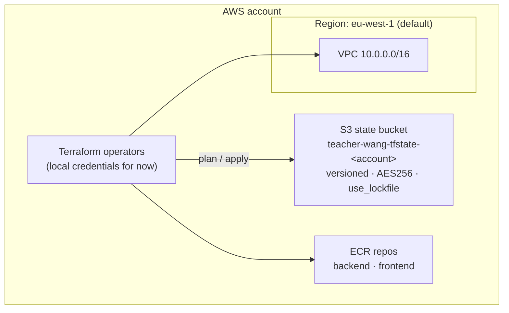
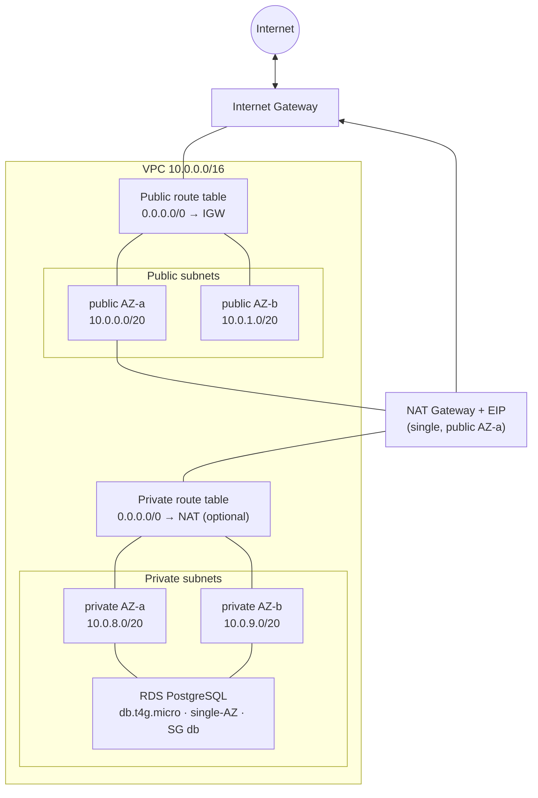
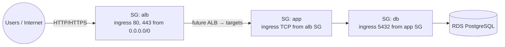
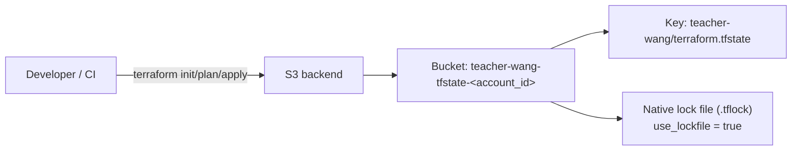
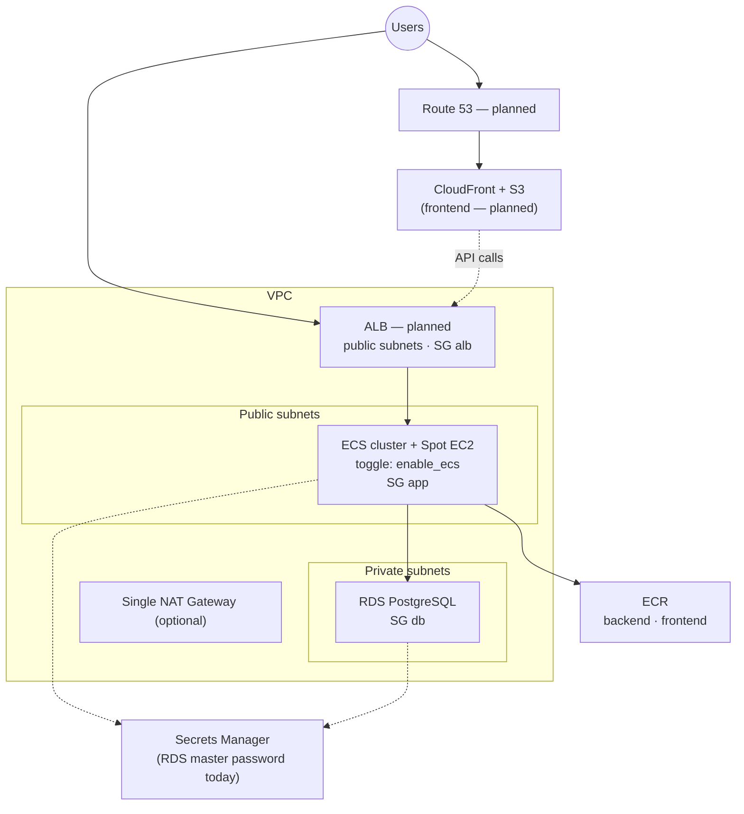
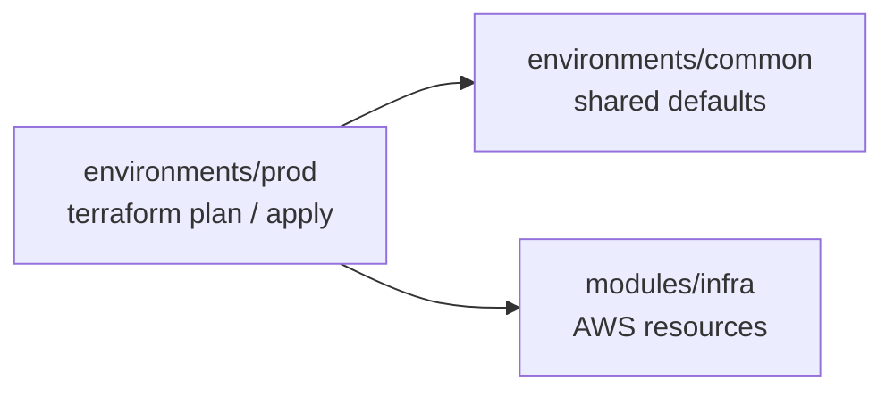

# Architecture

Living overview of the AWS layout provisioned by this repository.
Update this file whenever components are added, removed, or rewired.

Platform decision (ECS vs EKS): [`architecture-choice-ecs.md`](architecture-choice-ecs.md).

## Current state (networking + data + registry + optional ECS)

Provisioned today: remote state, VPC, subnets, IGW, optional single NAT, route tables, security group baselines, RDS PostgreSQL (single-AZ, `db.t4g.micro`), and ECR repositories for backend/frontend images.
ECS is **optional** via `enable_ecs` (default `false`) — control plane is free; cost is the Spot EC2 instance only.
Not yet provisioned (shown dashed in the target view): ECS services/tasks, ALB, CloudFront.

### High-level AWS account

### VPC networking

Cost choice: **one NAT Gateway** in the first public subnet, shared by all private subnets (`enable_nat_gateway`). ECS capacity currently uses **public** subnets with a public IP, so NAT is not required for the cluster.

### Security group baselines

Traffic is constrained by SG references (not CIDR between tiers).

| Security group | Purpose | Ingress | Egress |
| --- | --- | --- | --- |
| `alb` | Future public ALB | TCP 80, 443 from internet | all |
| `app` | ECS instances / tasks | TCP 1–65535 from `alb` | all (ECR / AWS APIs via public IP or NAT) |
| `db` | RDS PostgreSQL | TCP 5432 from `app` | none defined |

### RDS PostgreSQL

| Setting | Value | Rationale |
| --- | --- | --- |
| Class | `db.t4g.micro` | Lowest-cost burstable (ARM) |
| Multi-AZ | off | Avoid ~2× instance cost until HA is required |
| Storage | 20 GiB gp3, encrypted | Free-tier–friendly baseline |
| Network | Private subnets, not public | Only reachable via app SG |
| Password | RDS-managed Secrets Manager secret | No password in Terraform state |
| Backups | 1-day retention | Free-tier account limit; raise when upgrading the account plan |

### ECR repositories

| Setting | Value | Rationale |
| --- | --- | --- |
| Repos | `teacher-wang-prod-backend`, `teacher-wang-prod-frontend` | One image stream per app component |
| Encryption | AES256 | No CMK charge |
| Scan on push | basic | Free vulnerability scan |
| Lifecycle | expire untagged after 7d; keep last 10 tags | Cap storage cost |
| Tag mutability | mutable | Convenient `:latest` while iterating |

### ECS (optional — `enable_ecs`)

Toggle in `environments/prod/main.tf`. See [`architecture-choice-ecs.md`](architecture-choice-ecs.md).

| Setting | Value | Rationale |
| --- | --- | --- |
| Cluster | `teacher-wang-prod-ecs` | One cluster for frontend + backend |
| Capacity | 1× Spot `t4g.small` (min 0, max 2) | Cheap ARM host; bin-pack both apps |
| Subnets | Public + public IP | Pull from ECR without NAT |
| Instance SG | `app` | Tasks/instances can reach RDS on 5432 |
| Insights | Disabled | Avoid CloudWatch ingestion cost |
| Services / ALB | Not yet | Next roadmap items |

### Terraform remote state

## Target architecture (planned)

Shows how upcoming roadmap pieces attach to the network already in place.

ECS and NAT are off by default (`enable_ecs` / `enable_nat_gateway` = `false` in prod).

## Environments

Each environment directory is a **Terraform root**. Shared resources live in `modules/infra`; shared defaults live in `environments/common`.

| Path | Role |
| --- | --- |
| `modules/infra` | VPC, NAT, route tables, security groups, state bucket, RDS, ECR, optional ECS |
| `environments/common` | Shared defaults module (`project_name`, `aws_region`, `az_count`) |
| `environments/prod` | Prod root — `cd environments/prod && terraform plan` |

Add `environments/staging` or `environments/dev` later by copying the `prod` root layout.

## Naming and tagging

See [`tagging-and-naming.md`](tagging-and-naming.md).

Summary:

- **Names:** `{project}-{environment}-{role}[-qualifier]` via `local.name_prefix` in `modules/infra`
- **Required tags (provider default_tags):** `Project`, `Environment`, `ManagedBy`
- **Resource tags:** `Name` (always), `Tier` (`public` / `private` / `data` / `shared`)

## Cost posture

| Component | Cost impact | Notes |
| --- | --- | --- |
| VPC, subnets, route tables, SGs, IGW | Free | — |
| Single NAT Gateway + EIP | Paid (~$32/mo + data) | Toggle with `enable_nat_gateway`; not needed for current ECS placement |
| RDS `db.t4g.micro` single-AZ | Paid (~$12–15/mo + storage) | No Multi-AZ / PI / enhanced monitoring |
| RDS-managed Secrets Manager secret | Paid (~$0.40/mo) | Master password |
| ECR (empty / light use) | Near-free | Storage + data transfer; lifecycle keeps image count low |
| ECS control plane | **Free** | Why we chose ECS over EKS |
| ECS Spot `t4g.small` | Paid (~$5–12/mo) when on | Toggle with `enable_ecs` (default off) |
| EKS control plane | Avoided (~$73/mo) | See architecture-choice doc |
| Per-AZ NAT | Avoided | Would multiply NAT cost; single NAT is enough for now |

## Related docs

- [README.md](../README.md) — roadmap, getting started, tech choices
- [architecture-choice-ecs.md](architecture-choice-ecs.md) — why ECS instead of EKS
- [tagging-and-naming.md](tagging-and-naming.md) — Name pattern and required tags
- [agent.md](../agent.md) — agent rules (keep README + docs in sync)
