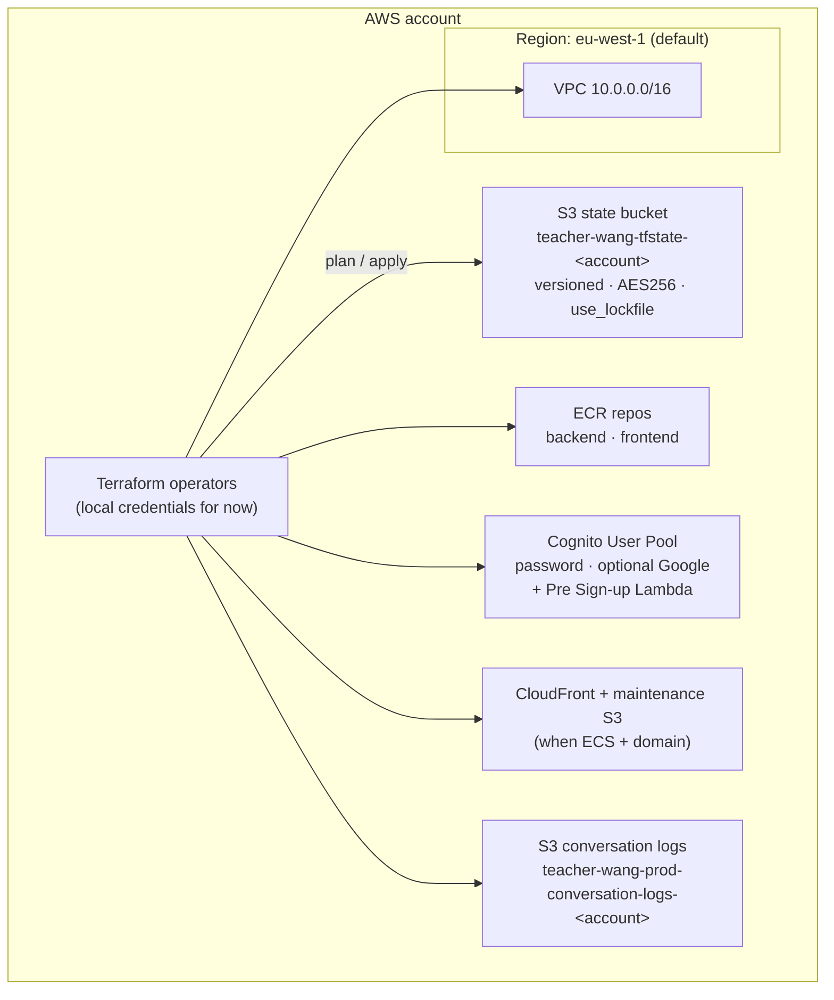
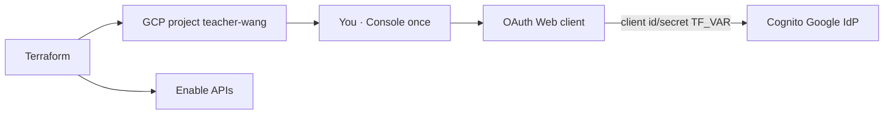
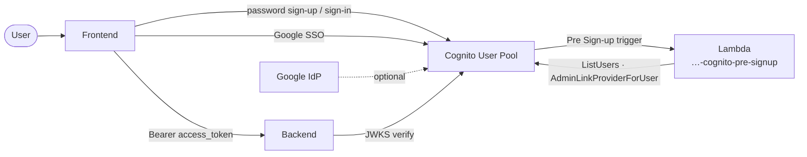
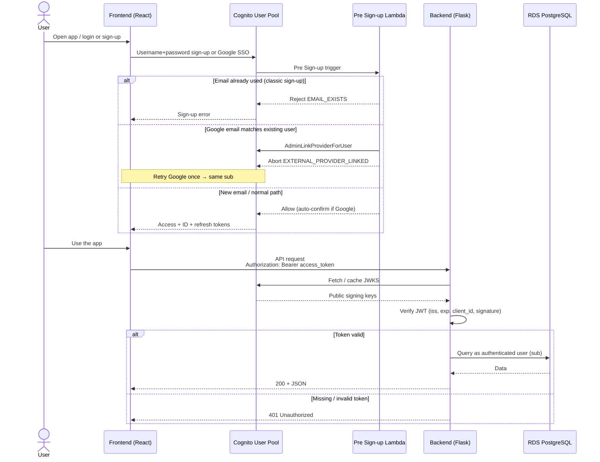
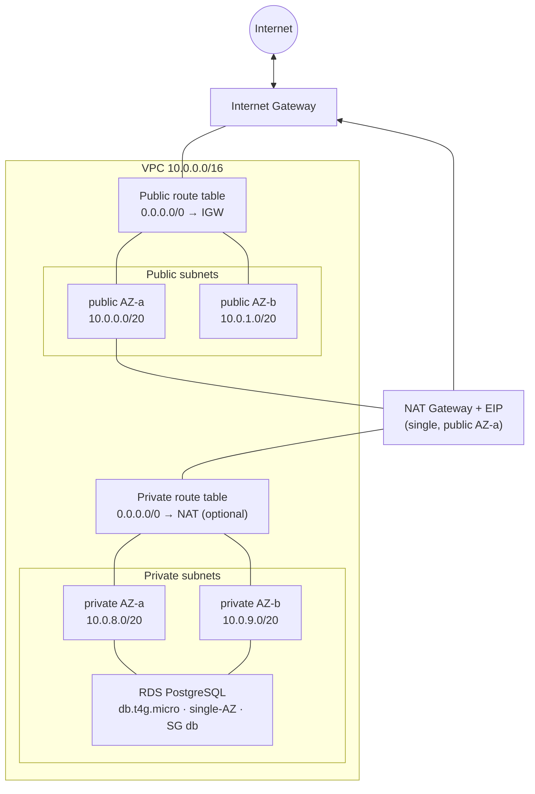
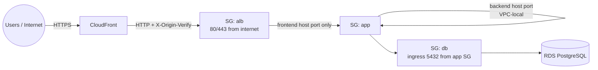
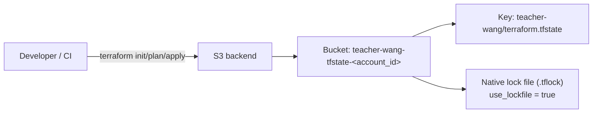
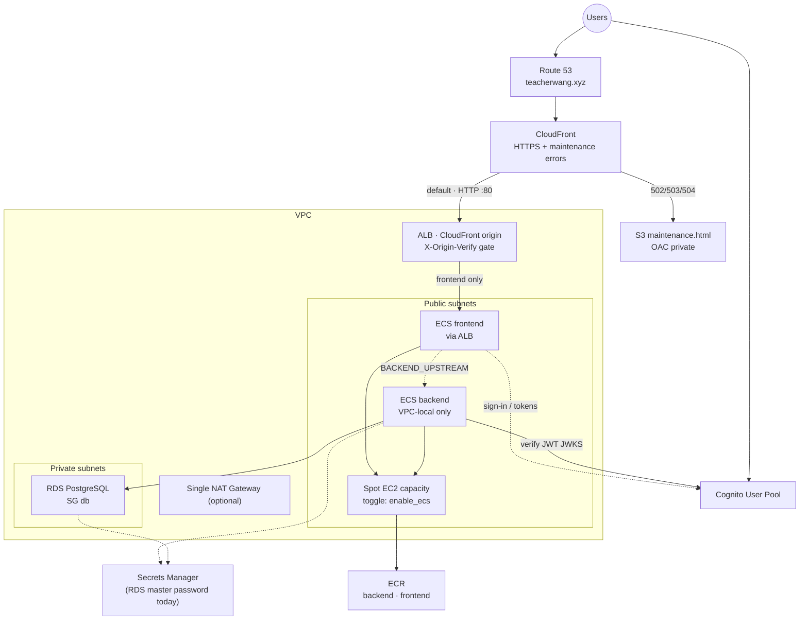
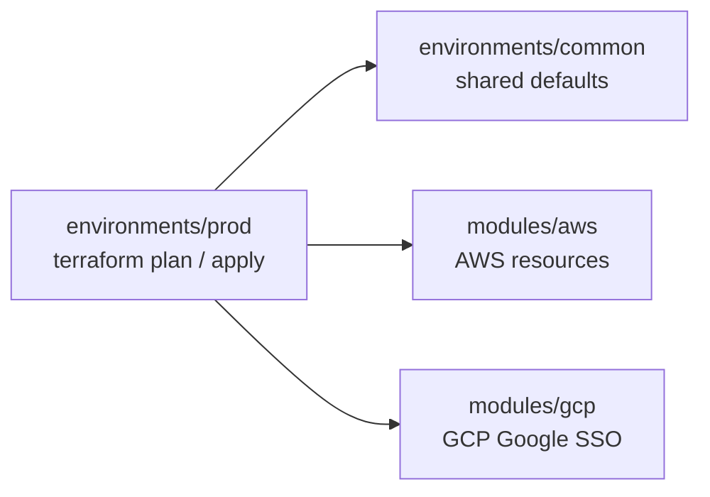

# Architecture

Living overview of the AWS layout provisioned by this repository.
Update this file whenever components are added, removed, or rewired.

Platform decision (ECS vs EKS): [`ecs-archi-decision.md`](ecs-archi-decision.md).  
Multi-user auth / tenancy / shared data: [`multi-user-archi-decision.md`](multi-user-archi-decision.md).

## Current state (networking + data + registry + Cognito + optional ECS + CloudFront)

Provisioned today: remote state, VPC, subnets, IGW, optional single NAT, route tables, security group baselines, RDS PostgreSQL (single-AZ, `db.t4g.micro`), ECR repositories for backend/frontend images, and a **Cognito User Pool** (app client + Hosted UI domain; optional Google IdP when OAuth secrets are set).
ECS is **optional** via `enable_ecs` (default `false`) — control plane is free; cost is the Spot EC2 instance + ALB. When enabled, backend/frontend services, a **public ALB (frontend only)**, and **CloudFront** (apex DNS + deploy maintenance page) are created too; tasks receive Cognito env vars for JWT verification plus `CONVERSATION_LOGS_*` pointing at the private conversation-logs S3 bucket (`users/{cognito_sub}/…`).
DNS/TLS for **`teacherwang.xyz`** (registered at **Namecheap**; Route 53 + ACM via `alb_domain_name`); public HTTPS is on CloudFront when ECS is on.

### High-level AWS account

### Cognito (end-user identity)

| Setting | Value | Rationale |
| --- | --- | --- |
| User pool | `{project}-{env}-users` | Username sign-in; email required |
| App client | Public SPA (no secret); auth code + PKCE / SRP | React obtains tokens; Flask verifies access JWT |
| Domain | `{name_prefix}-{account_id}.auth.{region}.amazoncognito.com` | Hosted UI / Google redirect |
| Google IdP | When `TF_VAR_cognito_google_client_*` or secret ARN set | Password + Google SSO |
| Google redirect | `cognito_google_redirect_uri` output | Paste into Google Cloud OAuth Web client |
| Unique email / account link | Pre Sign-up Lambda (`…-cognito-pre-signup`) | Same email → same Cognito user for password + Google |
| Callbacks | `https://teacherwang.xyz` (+ `/login`) and localhost Vite | Prod + local dev |
| Cost | ~$0 under early MAU free tier; Lambda cheap | Matches cost posture |
| GCP project | `teacher-wang` (`module.gcp`) | Billing linked; OAuth Web client Console-once |

### GCP (Google SSO scaffolding)

Email identity rules (Pre Sign-up Lambda):

1. Classic sign-up with an email that already exists → rejected (`EMAIL_EXISTS`).
2. Google SSO with an email that already has a password user → `AdminLinkProviderForUser`, no second Cognito profile. First Google attempt after linking may return `EXTERNAL_PROVIDER_LINKED`; retry Google sign-in (same Cognito `sub` thereafter).
3. Google SSO for a brand-new email → create user as usual (auto-confirm / auto-verify email).

Sign-in goes to Cognito; API calls carry the access token. The backend never sees passwords — it only verifies JWTs against the pool JWKS.

Public Cognito ids are baked into the frontend image at build time (`VITE_COGNITO_*`); the backend receives `COGNITO_*` from the ECS task definition at runtime. Probe route: `GET /auth/me`.

### VPC networking

Cost choice: **one NAT Gateway** in the first public subnet, shared by all private subnets (`enable_nat_gateway`). ECS capacity currently uses **public** subnets with a public IP, so NAT is not required for the cluster.

### Security group baselines

Traffic is constrained by SG references (not CIDR between tiers).

| Security group | Purpose | Ingress | Egress |
| --- | --- | --- | --- |
| `alb` | ALB (CloudFront origin) | TCP 80, 443 from internet; listener requires `X-Origin-Verify` | all |
| `app` | ECS instances / tasks | Frontend host port from `alb`; backend host port from `app` (VPC-local) | all |
| `db` | RDS PostgreSQL | TCP 5432 from `app` | none defined |

### RDS PostgreSQL

| Setting | Value | Rationale |
| --- | --- | --- |
| Class | `db.t4g.micro` | Lowest-cost burstable (ARM) |
| Multi-AZ | off | Avoid ~2× instance cost until HA is required |
| Storage | 20 GiB gp3, encrypted | Free-tier–friendly baseline |
| Network | Private subnets, not public | Only reachable via app SG |
| Password | RDS-managed Secrets Manager secret | No password in Terraform state |
| Backups | 1-day retention | Free-tier account limit; raise when upgrading the account plan |

### ECR repositories

| Setting | Value | Rationale |
| --- | --- | --- |
| Repos | `teacher-wang-prod-backend`, `teacher-wang-prod-frontend` | One image stream per app component |
| Encryption | AES256 | No CMK charge |
| Scan on push | basic | Free vulnerability scan |
| Lifecycle | expire untagged after 7d; keep last 10 tags | Cap storage cost |
| Tag mutability | mutable | Convenient `:latest` while iterating |

### ECS (optional — `enable_ecs`)

Toggle in `environments/prod/main.tf`. See [`ecs-archi-decision.md`](ecs-archi-decision.md).

| Setting | Value | Rationale |
| --- | --- | --- |
| Cluster | `teacher-wang-prod-ecs` | One cluster for frontend + backend |
| Capacity | 1× Spot `t4g.small` (min 0, max 2) | Cheap ARM host; bin-pack both apps |
| Subnets | Public + public IP | Pull from ECR without NAT |
| Instance SG | `app` | Tasks/instances can reach RDS on 5432 |
| Backend task | 512 CPU / 512 MiB, host port 5000 | Fits with frontend on one `t4g.small` |
| Frontend task | 256 CPU / 256 MiB, host port 8080 | Static/nginx-style container |
| Env / secrets | `DB_*` + `DB_PASSWORD` from Secrets Manager; `COGNITO_*` for JWT | Password not in Terraform state or task JSON plaintext |
| Logs | `/ecs/.../backend` and `/frontend`, 7-day retention | Cap CloudWatch cost |
| Insights | Disabled | Avoid CloudWatch ingestion cost |

### ALB (with `enable_ecs`)

| Setting | Value | Rationale |
| --- | --- | --- |
| Scheme | Internet-facing (origin for CloudFront) | Public web UI only via CDN |
| Domain | `teacherwang.xyz` (Namecheap; `alb_domain_name`) | Cheap `.xyz` + Route 53 |
| Listener HTTP `:80` | Default 403; rule forwards if `X-Origin-Verify` matches | Blocks ALB DNS bypass without CF |
| Listener HTTPS `:443` | Same secret-header gate (regional ACM) | Direct HTTPS to ALB also gated |
| Frontend TG | Instance targets, host port 8080 | Bridge-mode ECS |
| Backend | Not registered on ALB | API stays VPC-local; frontend should reverse-proxy via `BACKEND_UPSTREAM` |
| Origin secret | `random_password` → CF custom header + ALB rule | Avoids CloudFront prefix-list SG quota blow-up |
| Access logs | Off | Avoid S3 log storage cost |

### CloudFront + maintenance page (with `enable_ecs` + domain)

| Setting | Value | Rationale |
| --- | --- | --- |
| Distribution | `{project}-{env}-cdn` | Apex `teacherwang.xyz` → CDN |
| Default origin | ALB DNS name, HTTP :80 + `X-Origin-Verify` | Avoid second hostname/cert for origin TLS |
| Error pages | S3 `…-maintenance-<account>` + OAC | `/maintenance.html` on origin 502/503/504 |
| Error cache TTL | 30s | Short so the site recovers quickly after deploy |
| Viewer cert | ACM in **us-east-1** | CloudFront requirement (free) |
| Price class | `PriceClass_100` (NA + EU) | Enough for this audience; cheaper |
| Cost | ~$0 under Free / always-free allowances | Hobby traffic stays in free tier |

During single-host ECS deploys (`min_healthy=0`), the ALB has no healthy targets and returns 503. CloudFront serves the Teacher Wang–styled maintenance HTML instead of the raw ALB error page. Source: `modules/aws/static/maintenance/maintenance.html`.

### DNS / TLS (`alb_domain_name`)

| Setting | Value | Rationale |
| --- | --- | --- |
| Route 53 zone | Apex `teacherwang.xyz` | ~$0.50/mo; automatic ACM validation + alias |
| ACM (ALB) | DNS-validated, `eu-west-1` | Free; ALB :443 |
| ACM (CloudFront) | DNS-validated, `us-east-1` | Free; viewer HTTPS |
| Apex records | Alias `A`/`AAAA` → CloudFront | Only while `enable_ecs` is true |
| Registrar | **Namecheap** — Custom DNS → `route53_name_servers` | One-time after zone create |

### Terraform remote state

## Target architecture (planned)

Shows how upcoming pieces attach to what is already in place.

ECS + ALB + CloudFront are created together when `enable_ecs = true` and `alb_domain_name` is set.

## Environments

Each environment directory is a **Terraform root**. Shared resources live in `modules/aws`; shared defaults live in `environments/common`.

| Path | Role |
| --- | --- |
| `modules/aws` | VPC, NAT, route tables, security groups, state bucket, RDS, ECR, Cognito, optional ECS + ALB + CloudFront, Route 53 + ACM |
| `modules/gcp` | GCP project, billing link, APIs, OAuth Console checklist for Google SSO |
| `environments/common` | Shared defaults module (`project_name`, `aws_region`, `az_count`) |
| `environments/prod` | Prod root — `cd environments/prod && terraform plan` |

Add `environments/staging` or `environments/dev` later by copying the `prod` root layout.

## Naming and tagging

See [`tagging-and-naming.md`](tagging-and-naming.md).

Summary:

- **Names:** `{project}-{environment}-{role}[-qualifier]` via `local.name_prefix` in `modules/aws`
- **Required tags (provider default_tags):** `Project`, `Environment`, `ManagedBy`
- **Resource tags:** `Name` (always), `Tier` (`public` / `private` / `data` / `shared`)

## Cost posture

| Component | Cost impact | Notes |
| --- | --- | --- |
| VPC, subnets, route tables, SGs, IGW | Free | — |
| Single NAT Gateway + EIP | Paid (~$32/mo + data) | Toggle with `enable_nat_gateway`; not needed for current ECS placement |
| RDS `db.t4g.micro` single-AZ | Paid (~$12–15/mo + storage) | No Multi-AZ / PI / enhanced monitoring |
| RDS-managed Secrets Manager secret | Paid (~$0.40/mo) | Master password |
| Cognito User Pool | ~$0 under free-tier MAU | Google IdP optional; no always-on compute |
| ECR (empty / light use) | Near-free | Storage + data transfer; lifecycle keeps image count low |
| ECS control plane | **Free** | Why we chose ECS over EKS |
| ECS Spot `t4g.small` | Paid (~$5–12/mo) when on | Toggle with `enable_ecs` (default off) |
| ALB (with ECS) | Paid (~$16/mo + LCU) when on | CloudFront origin; destroyed with `enable_ecs` |
| CloudFront + maintenance S3 | ~$0 under free allowances | Custom 502/503/504 → maintenance.html |
| Route 53 hosted zone | ~$0.50/mo when `alb_domain_name` set | `teacherwang.xyz` (Namecheap registration) |
| ACM public certs | Free | ALB (`eu-west-1`) + CloudFront (`us-east-1`) |
| ECS task logs (7-day retention) | Low | `/ecs/…/backend` and `/frontend` |
| Public IPv4 on ECS instances | ~$3.6/mo each when associated | Public subnet placement (no NAT) |
| EKS control plane | Avoided (~$73/mo) | See [`ecs-archi-decision.md`](ecs-archi-decision.md) |
| Per-AZ NAT | Avoided | Would multiply NAT cost; single NAT is enough for now |

## Related docs

- [README.md](../README.md) — roadmap, getting started, tech choices
- [ecs-archi-decision.md](ecs-archi-decision.md) — why ECS instead of EKS
- [multi-user-archi-decision.md](multi-user-archi-decision.md) — credentials, per-user isolation, shared read-only data
- [tagging-and-naming.md](tagging-and-naming.md) — Name pattern and required tags
- [agent.md](../agent.md) — agent rules (keep README + docs in sync)
