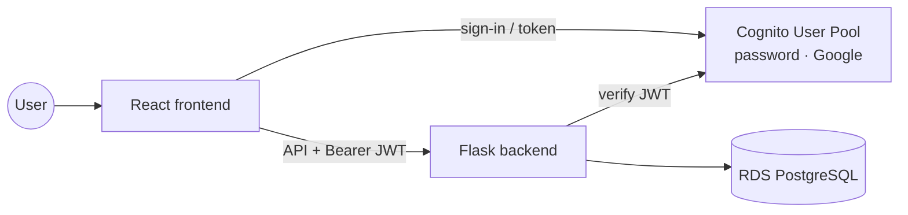
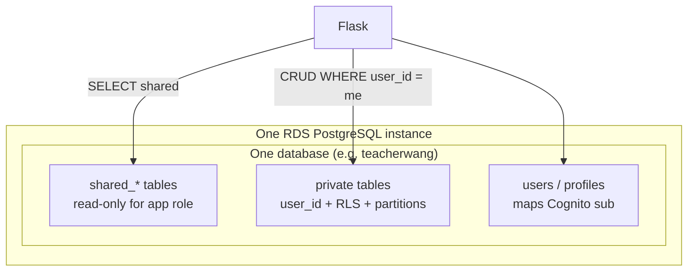
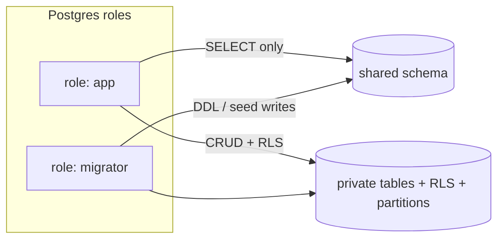
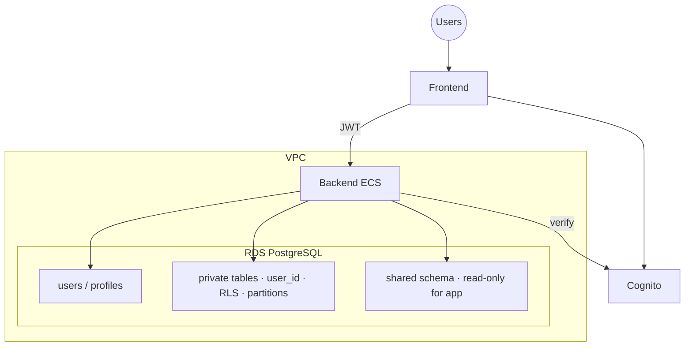

# Multi-user Architecture

Decision record for how **teacher-wang-app** should support several users signing in (username + email + password, or Google SSO), keep each user’s data private, and still expose some **shared read-only** content to everyone.

Related: [`architecture.md`](architecture.md) (what is provisioned), [`ecs-archi-decision.md`](ecs-archi-decision.md) (compute), [`../README.md`](../README.md) (roadmap).

## Status

Accepted — implement in the app + this repo when ready. No Cognito / role infra provisioned yet.

## Decision summary

| # | Concern | Choice |
| --- | --- | --- |
| 1 | Credentials / Google SSO | **Amazon Cognito User Pools** (password + Google); app stores `sub` + profile only |
| 2 | Per-user data | **One RDS DB**, shared schema, **`user_id` + RLS**, with **table partitioning** for scale; revisit schema- or DB-per-user if needed |
| 3 | Shared catalog | **Same DB**, `shared` schema / `shared_*` tables; app role **SELECT-only**; evolves with Decision 2 if siloed later |
| — | RDS topology | Keep single `db.t4g.micro` until size forces a change |

## Context

Today the stack is:

- One **RDS PostgreSQL** instance (`db.t4g.micro`, single-AZ, private) with one initial database
- Flask backend + React frontend on optional **ECS**
- No end-user identity product yet (only the RDS master password in Secrets Manager)

Product constraints that locked the decisions:

| Topic | Answer |
| --- | --- |
| Identity | Cognito (password + Google SSO) |
| Tenancy grain | **1 user = 1 data owner** (no families / classes / orgs for now) |
| Shared data shape | Relational **text only** for now — no large blobs / media volume |
| Who writes shared data | **Only the operator** via migrations / seeds (no in-app admin role yet) |
| Compliance | No per-user backup/restore or certified isolation requirement for now |
| Scale posture | Tens to low hundreds of users first; cost posture remains “cheapest viable” (`agent.md`) |

---

## Decision 1 — Where to store credentials (identity)

**Chosen: Amazon Cognito User Pools.**

Never store user passwords in application tables as plaintext or reversible crypto. Cognito handles hashing, recovery, and Google OIDC. The app stores only a **stable subject id** (`sub`) and profile fields it needs (display name, email for UX), and authorizes API calls with tokens issued by Cognito.

### Options considered

| Option | What it is | ~Cost (small MAU) | Outcome |
| --- | --- | --- | --- |
| **A. Amazon Cognito User Pools** | Managed directory; username/email/password; Google social IdP | **~$0** under ~10k MAU (Lite/Essentials free tier) | **Chosen** |
| **B. App-owned auth in Postgres** + Google OAuth in the backend | You hash passwords, reset, sessions, Google verify yourself | Infra $0; engineering + security risk | Rejected |
| **C. Auth0 / Clerk / similar SaaS** | Polished UX, dashboards | Free then **$/MAU** | Rejected (cost / extra vendor) |
| **D. Self-hosted Keycloak / SuperTokens** on ECS | Full control, open source | Always-on ECS/RAM + ops | Rejected (overkill) |

### Pros / cons (chosen vs rejected)

**A. Cognito (chosen)**

| Pros | Cons |
| --- | --- |
| Passwords and Google SSO without building crypto/reset flows | Hosted UI / DX is clunkier than Clerk |
| Generous free tier; aligns with cost posture | Advanced threat protection / enterprise SAML is extra $ |
| JWT / OIDC tokens easy to validate in Flask | Password hashes are **not exportable** (migration out is painful) |
| Terraform can own the user pool, app client, Google IdP | Custom attributes / groups are primitives — build product logic yourself |

**B / C / D** rejected for security debt, MAU cost, or always-on ops — see earlier comparison tables in git history if needed.

### Target shape



**Infra when implemented:** Cognito user pool + app client + Google IdP in Terraform; backend env for pool id / client id / region; optional Secrets Manager for Google OAuth client secret. Thin `users` / `profiles` table in Postgres keyed by Cognito `sub`. Do **not** store password hashes in RDS.

---

## Decision 2 — Per-user data isolation in RDS

**Chosen: shared schema + `user_id` (+ RLS), with declarative table partitioning for scalability.**

One RDS instance can host many logical databases (Cloud SQL–style). We stay on **one database** and isolate by row. Schema-per-user and database-per-user remain **escape hatches** if we hit scalability or isolation limits later — not day-one design.

You do **not** need a separate RDS instance per user (that would multiply the ~$12–15/mo floor).

### Options considered

| Option | Isolation model | Ops / migrations | Cost on current `db.t4g.micro` | Outcome |
| --- | --- | --- | --- | --- |
| **1. Shared schema + `user_id` (+ RLS) + partitions** | Logical (row) | One migration path (Alembic once) | **Lowest** | **Chosen (now)** |
| **2. Schema per user** | Logical (namespace) | Migrations × N schemas | Same instance $; catalog churn at scale | **Future option** |
| **3. Database per user** (same RDS) | Stronger logical | Migrations × N DBs; pools per DB | Same instance $; admin cost rises | **Future option** |
| **4. RDS instance per user** | Physical | Extreme | **~$12–15+/user/mo** | Rejected |

### Chosen model

```text
lessons (id, user_id, …)   -- PARTITION BY … (see below)
notes  (id, user_id, …)
-- every private row tagged with the owning Cognito sub / internal user UUID
```

| Pros | Cons |
| --- | --- |
| One pool, one Alembic history, one backup | A forgotten `WHERE user_id = …` is a data leak unless RLS backs you up |
| Scales further with partitions without changing tenancy model | Per-user restore/export needs app-level tooling |
| Matches AWS SaaS “pool” guidance | Noisy neighbor shares CPU/IO (fine at small scale) |
| Shared read-only tables live naturally in the same DB | Partition design must be chosen carefully (key + strategy) |

**Defense in depth:**

1. Application always filters by authenticated `user_id`
2. PostgreSQL **RLS** policies as a backstop (`SET LOCAL app.user_id = …` per request)
3. Index `(user_id, …)` on hot paths
4. **Declarative partitioning** on large private tables so growth does not flatten into one unmanageable heap

### Partitioning (scalability within shared schema)

Partitioning is an **in-model** scale lever: same tenancy story, better maintenance and query pruning as row counts grow.

Guidance for the app schema (Alembic in **teacher-wang-app**):

| Topic | Guidance |
| --- | --- |
| When to partition | Prefer partitioning early on tables expected to grow large (progress, events, cards); small lookup tables can stay unpartitioned |
| Partition key | Prefer a key that matches access patterns — often **`user_id`** (hash) or a **time** column (range) if queries are time-scoped; hash on `user_id` keeps one user’s rows co-located for pruning |
| Ops | Attach/detach partitions via migrations; avoid thousands of tiny partitions on `db.t4g.micro` |
| RLS | Still enable RLS on the parent; policies apply to partitions |

Exact partition strategy (hash vs range, modulus, time buckets) is an app/schema detail — keep it documented in Alembic migrations when introduced.

### Future escape hatches (schema or DB per user)

If we hit **scalability issues** (noisy neighbor, catalog/IO pressure, or a need for stronger siloed restore) despite partitioning:

| Escalation | When to consider | Impact on Decision 3 |
| --- | --- | --- |
| **Schema per user** | Moderate isolation need; still one connection string / DB | Keep `shared` (or `public`) schema for catalog; private data moves to `user_<id>` schemas |
| **Database per user** (same RDS) | Stronger logical isolation; drop-one-user easier | Shared catalog stays in a dedicated DB or shared schema reachable via a second connection / FDW — redesign then |

Do **not** jump to either until metrics or a concrete product need justify the ops cost.



---

## Decision 3 — Shared read-only data for all users

**Chosen: same database, shared schema (or `shared_*` tables), SELECT-only for the app role.**

Shared content is relational text only for now. Only the operator writes it via migrations / seeds. If Decision 2 later moves to schema- or DB-per-user, the shared catalog stays centralized and is re-wired (same DB `shared` schema, or a dedicated shared DB) — not duplicated per user.

### Options considered

| Option | How it works | Outcome |
| --- | --- | --- |
| **A. Same DB, `shared` schema / `shared_*`, no `user_id`** | App role `SELECT` only; writes via migrator | **Chosen** |
| **B. Same tables with `visibility = public` / `owner_id NULL`** | Mix shared + private | Rejected (weaker clarity) |
| **C. Separate database on same RDS** | Two DBs / pools or FDW | Deferred — possible if Decision 2 goes DB-per-user |
| **D. Separate RDS instance for shared content** | Fully separate | Rejected (2× RDS floor) |
| **E. S3 for bulky shared assets** + RDS metadata | Blobs off DB | Not needed yet (text only) |

### Enforcement

Wire **two PostgreSQL roles** (still one RDS instance):

| Role | Usage | Privileges |
| --- | --- | --- |
| `app` (ECS task) | Normal API | `SELECT` on shared; `SELECT/INSERT/UPDATE/DELETE` on private tables (RLS applies) |
| `migrator` / admin | Alembic, seeds | DDL + write to shared |

Enforce read-only in **three** places: DB grants, Flask routes (no mutating shared APIs for normal users), and `REVOKE INSERT/UPDATE/DELETE` on shared so a bug cannot write shared rows.



---

## Target architecture



### Rough cost impact

| Piece | Extra monthly cost (early) |
| --- | --- |
| Cognito (≤ ~10k MAU, social Google) | ~$0 |
| Extra RDS instance / DB-per-user | Avoided |
| Second Postgres role / shared schema / partitions | $0 |
| Optional: SES for Cognito email verification | Low / pay-per-email (or Cognito defaults carefully) |
| Google Cloud OAuth client | Free (Google Cloud console) |

---

## Alternatives rejected (for now)

| Idea | Why not (yet) |
| --- | --- |
| Password hashes in `users` table as primary IdP | Security and feature debt (reset, Google link, MFA) |
| Schema or database per user from day one | Ops/migration cost; partitioning covers early scale — keep as escalation |
| RDS per user | Cost non-starter |
| Separate RDS for shared data | Doubles DB floor for little gain |
| S3 for shared content | No large/binary shared volume yet |
| Org / class multi-tenancy | Out of scope — 1 user = 1 data owner |
| EKS / extra services for tenancy | Unrelated; tenancy is a data + IdP concern |

---

## When to revisit

- Cognito lock-in blocks a required migration → plan dual-run or accept re-registration
- Partitioning + RLS no longer enough (noisy neighbor, restore needs) → evaluate **schema per user** or **database per user** on the same RDS; redesign shared-catalog access accordingly
- Shared dataset becomes media-heavy → S3 (+ CloudFront) for blobs, RDS for indexes
- Org-level multi-tenancy appears → introduce `tenant_id` (org) **and** `user_id`, not only user-scoped rows

**Locked default:** Cognito + single Postgres DB (shared schema + RLS + partitions) + shared read-only schema.
